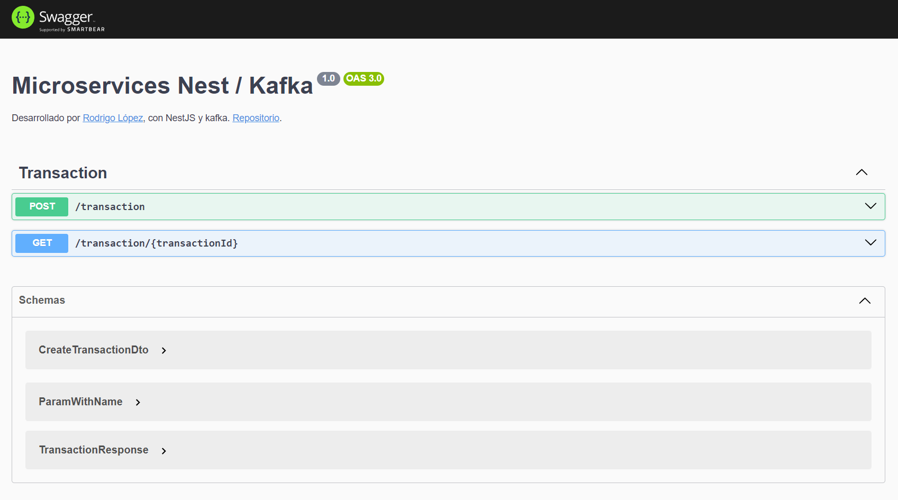
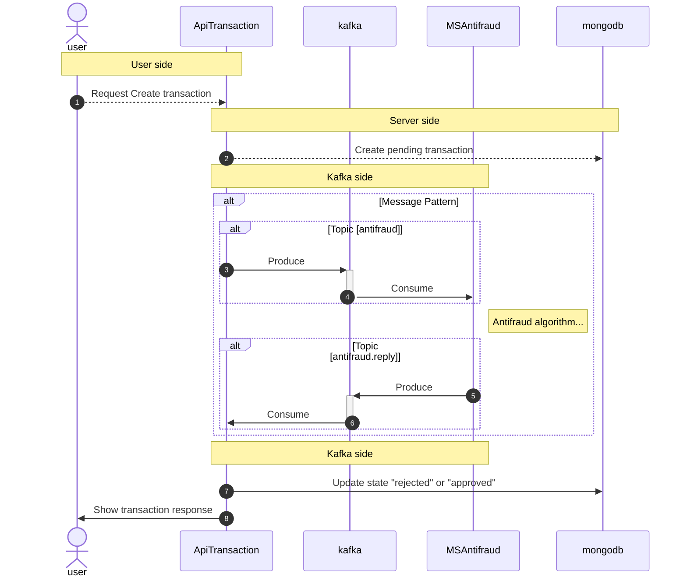

# Microservicio - NestJS / Kafka :rocket:

- [Descripción](#Descripción)
- [Instalación](#Instalación)
- [Diagrama de Arquitectura](#Diagrama_de_Arquitectura)
- [Performance Testing](#Performance_Testing)

# Descripción

Se realizó una solución que disponibiliza un conjunto un APIs que internamente se comunican
con un microservicio antifraude mediante kafka, toda información generada se almacena en mongobd.

- MongoDb: Base de datos.
- NestJS (api-transaction): Backend y API-Gateway.
- NestJS (ms-antifraud): Microservicio de validación de transacciones.
- confluentinc/cp-kafka: Kafka server.
- provectuslabs/kafka-ui: Web app para administración y GUI de kafka.

# Instalación

Para levantar la infraestructura completa, ejecutar.

> ⚠️ **Warning:** Archivo .env fue incluido para faciliar el bootstrap del proyecto a un solo comando, incluir este archivo en otros proyectos bajo su propia responsabilidad, no recomendado para apps productivas.

```bash
docker-compose up -d
```

# Ejecución

- El API-Transaction disponibiliza la UI de swagger para ocupar los servicios con facilidad.



- Ejecutar desde la terminal con cURL.

```bash
curl -X 'POST' \
  'http://localhost:3000/transaction' \
  -H 'accept: */*' \
  -H 'Content-Type: application/json' \
  -d '{
  "accountExternalIdDebit": "12341234",
  "accountExternalIdCredit": "12341234",
  "tranferTypeId": 1,
  "value": 500
}'
```

<div style="border-left: 4px solid #f39c12; padding: 10px; background-color: #fff3cd;">
<strong>NOTA:</strong> Modificar .env a conveniencia, los valores por defector desplegan un servicio en el puerto 3000.
</div>

<br/>

# Diagrama_de_Arquitectura

El software incluye una implementación de un API-Gateway (backend) que se comunica con el microservicio mediante TRANSPORT.KAFKA.



# Performance_Testing

Se dejó un plan de pruebas para Apache JMeter.
La aplicación fue testeada con 1K peticiones por segundo por 10 segundos.

[File](./docs/Antifraud.jmx)
